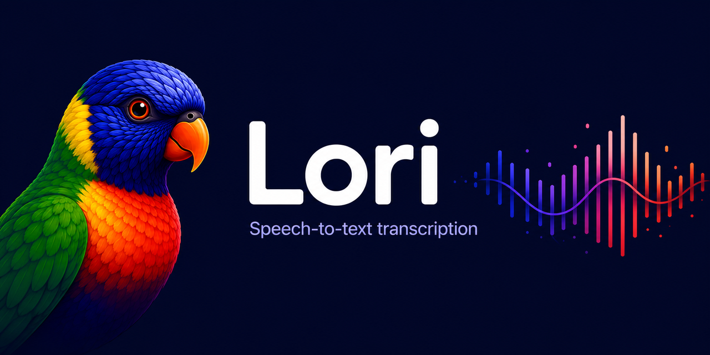

# Lori Stream — streaming voice input for macOS



Press a button — speak — press again. Text is pasted wherever your cursor is.


**The streaming twist:** transcription happens *while you speak*. Audio is cut
into segments at natural pauses in your speech, and each finished segment is
transcribed in the background as the recording continues. When you press stop,
only the short tail is left — the paste arrives in **~1–2 seconds** even after
a several-minute dictation (the classic stop-then-transcribe approach takes
~20 seconds there).

**Transcription is fully local.** Nothing leaves your machine. No API key needed.

> Sibling project: [Lori](https://github.com/Ri-Ri-Ri/lori) — the stable,
> simpler build (record, then transcribe). Lori Stream is its experimental
> streaming counterpart. They can run side by side — see
> [Running next to Lori](#running-next-to-lori).

---

## What it does

- Records audio from your microphone
- Cuts the stream into segments at natural pauses (≥0.6 s of silence once a segment is ≥8 s long; hard cut at 30 s so one breathless monologue still streams)
- Transcribes each segment immediately with [mlx-whisper](https://github.com/ml-explore/mlx-examples/tree/main/whisper) (model `mlx-community/whisper-medium-mlx`) — Whisper medium accelerated on Apple Neural Engine via MLX — while the recording continues
- On stop: transcribes the tail, joins the segments in order, pastes via clipboard (⌘V) into any application — your previous clipboard content is restored after pasting
- Runs in the background, starts automatically at login
- Privacy-minded: transcripts are never written to the log (only their length), trigger/lock files live in a private per-user directory (`~/Library/Application Support/lori/`, mode 0700), recording auto-stops after 10 minutes if you forget it
- Each segment is decoded independently (`condition_on_previous_text=False`) plus a repeat-loop collapse filter — Whisper's classic looping hallucinations don't spread between segments

**Requirements:** macOS 13+ (Apple Silicon runs on Neural Engine; Intel will be noticeably slower), Python 3.11–3.13 (recommended: install from [python.org](https://python.org/downloads/)), ~1.5 GB free disk space (mlx-whisper medium model, cached once; shared with Lori if it's installed).

---

## Installation

```bash
git clone https://github.com/Ri-Ri-Ri/lori-stream.git
cd lori-stream
bash install.sh
```

The script will:
- find Python
- install dependencies (Python packages including `mlx-whisper`)
- create a launchd agent (auto-start)

The mlx-whisper medium model (~1.4 GB) downloads automatically on first run and
is cached locally — only once. If the stable Lori is already installed
(`~/.lori/models` exists), its model cache is reused and nothing new is downloaded.

After installation you need to manually grant permissions and set up a keyboard
shortcut — install.sh will print the instructions. If the stable Lori is already
set up on this Mac, the macOS permissions are already in place.

---

## macOS Permissions (required)

Without these the system won't work. (Same as for Lori — if Lori already works
on this Mac, skip this section.)

### 1. Accessibility — to paste text

`System Settings → Privacy & Security → Accessibility`

Add `Python.app`. Path is usually:
```
/Library/Frameworks/Python.framework/Versions/3.XX/Resources/Python.app
```
(replace XX with your version; install.sh will show the exact path)

### 2. Microphone — to record audio

`System Settings → Privacy & Security → Microphone`

Add the same `Python.app`.

If it is not in the list, start Lori Stream once and macOS should ask for
microphone permission.

### 3. Notifications — to see status notifications

`System Settings → Notifications → Python` → enable.

If notifications don't break through Do Not Disturb:
`System Settings → Focus → Sleep → Allowed Notifications → Apps → Python`

---

## Keyboard shortcut

Open **Shortcuts.app**:

1. Click **+** → New Shortcut
2. Add action **Run Shell Script**
3. Script:
   ```
   bash ~/.lori-stream/toggle-stream.sh
   ```
   (replace the path if you installed elsewhere)
4. Assign a key — e.g. ⌃⌥S. If you run the stable Lori too, give each build
   its own key. Avoid combinations your system already uses (e.g. ⌃⌥Space
   toggles input sources on many setups)
5. Save

First press — start recording (🎙 Recording notification).
Second press — stop + finish the tail + paste.

---

## Running next to Lori

Lori Stream is fully independent from the stable [Lori](https://github.com/Ri-Ri-Ri/lori):
its own trigger file, lock, log and launchd agent. You can install one, the
other, or both.

What the two builds share (by design, when both are installed):

- **Model cache** — Lori Stream reuses `~/.lori/models` if it exists, so the
  ~1.4 GB model is downloaded and stored only once
- **Last transcript** (`~/Library/Application Support/lori/last-transcript.txt`)
  — Lori's *repaste* hotkey re-pastes the latest transcript no matter which
  build produced it

Cost of running both: a second copy of whisper-medium in RAM (~1.5 GB) while
the agent is loaded. If you stop using one — unload its agent (see
[Managing the agent](#managing-the-agent)).

---

## Files

After installation:

```
~/.lori-stream/
├── lori_stream.py       — main script
├── config.json          — settings
├── toggle-stream.sh     — trigger (called from Shortcuts)
├── models/              — mlx-whisper model cache (HF_HOME), ~1.4 GB, downloaded once
│                          (not created if ~/.lori/models is reused)
└── lori-stream.log      — events log (rotates to lori-stream.log.1 at 1 MB; transcripts are not logged)

~/Library/LaunchAgents/
└── com.ri.lori-stream.agent.plist  — auto-start

~/Library/Application Support/lori/
├── toggle-stream        — trigger file (created by toggle-stream.sh, consumed by lori_stream.py)
├── last-transcript.txt  — last transcript (mode 0600), shared with Lori's repaste
└── lori-stream.lock     — single-instance lock
```

---

## Config

`~/.lori-stream/config.json`:

```json
{
  "language": "en",
  "sample_rate": 16000,
  "min_volume": 0.01,
  "debounce_seconds": 0.3,
  "max_recording_seconds": 600,
  "min_segment_seconds": 8.0,
  "max_segment_seconds": 30.0,
  "silence_seconds": 0.6,
  "silence_amplitude": 0.008
}
```

| Parameter | Value | Description |
|---|---|---|
| `language` | `"en"` | Transcription language. Set to `"auto"` to let Whisper detect the language automatically. Supports [99 languages](https://github.com/openai/whisper#available-models-and-languages): `"ru"`, `"uk"`, `"de"`, `"fr"`, `"es"`, and more. |
| `min_volume` | `0.01` | Silence threshold per segment. If quiet speech isn't transcribed — lower this value. |
| `debounce_seconds` | `0.3` | Protection against double-tap. |
| `max_recording_seconds` | `600` | Auto-stop for a forgotten recording. |
| `status_notifications` | `true` | Show the Recording → Transcribing banner (one replaceable notification, removed after the paste). Set to `false` to dictate silently. |
| `min_segment_seconds` | `8.0` | A segment must be at least this long before a pause can close it. Shorter → more, smaller segments (faster tail, slightly worse context per segment). |
| `max_segment_seconds` | `30.0` | Hard cut if no pause shows up — keeps continuous speech streaming. Matches Whisper's native 30 s window. |
| `silence_seconds` | `0.6` | How long a pause must last to close a segment. |
| `silence_amplitude` | `0.008` | Amplitude below which audio counts as silence. Raise if segments never close in a noisy room. |

> **Auto-detect:** set `"language": "auto"` and Whisper will detect the language
> per segment. Useful if you switch between languages often, but adds ~0.5s per segment.

After changing config — restart the agent.

---

## Managing the agent

```bash
# Check status
launchctl list | grep lori-stream.agent

# Restart
launchctl kill SIGTERM gui/$(id -u)/com.ri.lori-stream.agent

# Stop completely
launchctl unload ~/Library/LaunchAgents/com.ri.lori-stream.agent.plist

# Start again
launchctl load ~/Library/LaunchAgents/com.ri.lori-stream.agent.plist

# Live logs
tail -f ~/.lori-stream/lori-stream.log
```

---

## Self-test — run the engine on a wav file

Feed any wav through the segmentation engine as if it came from the microphone —
no recording, no pasting, results go to the log/stdout:

```bash
/Library/Frameworks/Python.framework/Versions/3.13/Resources/Python.app/Contents/MacOS/Python \
  ~/.lori-stream/lori_stream.py --selftest path/to/file.wav
```

Useful for tuning the segmentation parameters: the log shows where segments
were cut and how long each took to transcribe.

---

## Troubleshooting

Before digging in manually — check the log:
```bash
tail -40 ~/.lori-stream/lori-stream.log
```

A healthy long dictation looks like this:

```
[17:32:17] → start
[17:32:17] Recording started (streaming)
[17:32:26] Segment 0: 9.2s -> 77 chars in 0.6s     ← transcribed while still recording
[17:32:35] Segment 1: 8.6s -> 91 chars in 0.6s
[17:32:44] Segment 2: 8.7s -> 59 chars in 0.5s
[17:32:49] → stop
[17:32:49] Segment 3: 5.5s -> 46 chars in 0.4s     ← only the tail after stop
[17:32:49] Finish: 4 segment(s), tail wait 0.3s, 276 chars
[17:32:49] Paste (276 chars, 1 chunk(s))
[17:32:50] Paste: OK
```

| Symptom | Cause | Fix |
|---|---|---|
| `Segment N: ... too quiet, skipped` | Segment below `min_volume` | Speak louder or lower `min_volume` |
| Segments only appear at 30 s marks | Room too noisy — pauses never register as silence | Raise `silence_amplitude` (try 0.012) |
| Long `tail wait` in `Finish:` line | Tail segment still transcribing | Normal up to ~2 s; longer → check CPU load |
| `Paste: OK` in log but text appears late | The receiving app is busy (heavy terminal output etc.) and handles ⌘V late | Not a Lori Stream issue — paste into an idle window |
| Agent crashes on start | Same causes as Lori | See [Lori's troubleshooting](https://github.com/Ri-Ri-Ri/lori#troubleshooting) — dependency, permission and notification issues are identical |

---

## How it works

```
Shortcuts (keyboard shortcut)
        ↓
toggle-stream.sh → touch "~/Library/Application Support/lori/toggle-stream"
        ↓
file watcher in lori_stream.py (checks every 0.1s)
        ↓
sounddevice streams microphone audio into the current segment
        ↓ (pause ≥0.6s and segment ≥8s, or segment hits 30s)
segment goes to a background worker → mlx-whisper (Apple Neural Engine via MLX)
        ↓ (second press = stop)
tail segment transcribed, all texts joined in order
        ↓
CGEventPost (⌘V) pastes text
```

The launchd agent runs Python through `Python.app`, so macOS TCC permissions
are attached to the Python app bundle.

---

## Dependencies

| Package | Purpose |
|---|---|
| [`mlx-whisper`](https://pypi.org/project/mlx-whisper/) | speech transcription (Whisper medium on Apple Neural Engine via MLX) |
| `sounddevice` | microphone recording |
| `numpy` | audio processing |
| `pyobjc-framework-Quartz` | text pasting via CGEventPost |
| `pyobjc-framework-Cocoa` | clipboard NSPasteboard |
| `pyobjc-framework-UserNotifications` | notifications |
| `pyobjc-framework-AVFoundation` | (reserved) |
| `soundfile` | self-test wav input |

---

## Uninstalling

```bash
# Stop and remove agent
launchctl unload ~/Library/LaunchAgents/com.ri.lori-stream.agent.plist
rm ~/Library/LaunchAgents/com.ri.lori-stream.agent.plist

# Remove files (including cached mlx-whisper model in models/, if not shared with Lori)
rm -rf ~/.lori-stream
```

Remove permissions manually in System Settings → Privacy & Security
(only if the stable Lori doesn't use them too).

---

## License

[MIT](LICENSE)
